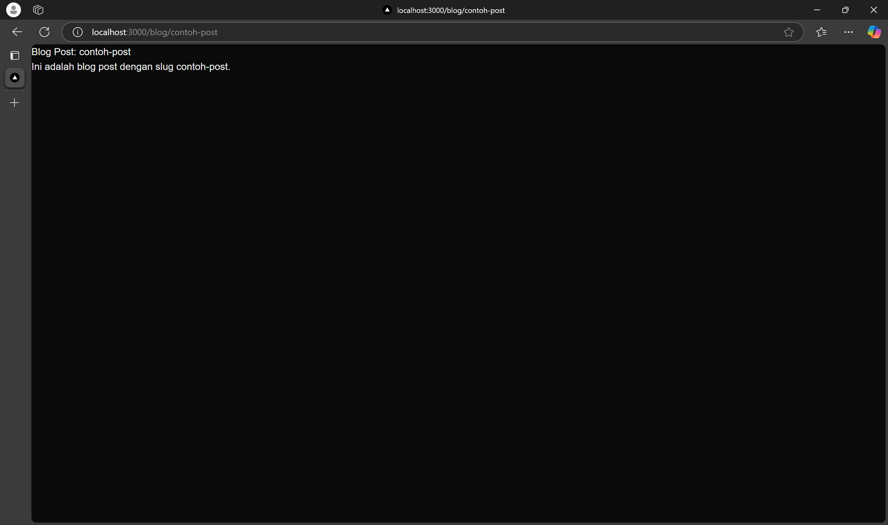

# Laporan Praktikum Pengenalan Next.js

|  | Pemrograman Berbasis Framework 2025 |
|--|--|
| NIM |  2241720206 |
| Nama |  Triyana Dewi Fatmawati |
| Kelas | TI - 3D |

## Langkah-langkah Praktikum
### A. Persiapan Lingkungan
1. Pastikan Node.js dan npm sudah terinstal di komputer Anda. Anda dapat memeriksanya dengan menjalankan perintah berikut di terminal atau command prompt:  

2. Buat direktori baru untuk proyek Next.js Anda 

3. Inisialisasi proyek Next.js dengan menjalankan perintah berikut: Perhatikan bahwa App Router belum digunakan  

4. Jalankan aplikasi Next.js
 
  

    Aplikasi akan terbuka di browser pada alamat http://localhost:3000. 
    
---

### B. Membuat Halaman dengan Server-Side Rendering (SSR)
1. Buka file pages/index.tsx di text editor Anda. 

2. Ganti kode di dalamnya dengan kode berikut untuk membuat halaman sederhana:  

3. Simpan file dan lihat perubahan di browser. Anda akan melihat halaman utama dengan teks "Selamat Datang di Website Saya!".  

---

### C. Menggunakan Static Site Generation (SSG) 
1. Buat file baru di direktori pages dengan nama blog.js. 
2. Tambahkan kode berikut untuk membuat halaman blog dengan SSG:   

3. Simpan file dan buka http://localhost:3000/blog di browser. Anda akan melihat daftar post yang diambil dari API eksternal.  

---

### D. Menggunakan Dynamic Routes 
1. Buat direktori baru di pages dengan nama blog. 

2. Buat file di dalam direktori blog dengan nama [slug].js 

3. Tambahkan kode berikut untuk membuat halaman dinamis berdasarkan slug:  

4. Simpan file dan buka http://localhost:3000/blog/contoh-post di browser. Anda akan melihat halaman yang menampilkan slug dari URL.  

---

### E. Menggunakan API Routes 
1. Pastikan terdapat direktori di pages dengan nama api. 

2. Buat file di dalam direktori api dengan nama products.js. 

3. Tambahkan kode berikut untuk membuat API route yang mengembalikan daftar produk:  

4. Buat file baru di pages dengan nama products.js untuk menampilkan daftar produk:  

5. Simpan file dan buka http://localhost:3000/products di browser. Anda akan melihat daftar produk yang diambil dari API route.  

---

### F. Menggunakan Link Component 
1. Buka file pages/index.tsx dan tambahkan modif dengan kode berikut untuk membuat link ke halaman lain:  

2. Buat file baru di pages dengan nama about.js untuk halaman "Tentang Kami":  

3. Simpan file dan buka http://localhost:3000 di browser. Klik link "Tentang Kami" untuk navigasi ke halaman tentang.  
  

---

## Tugas
1. Buat halaman baru dengan menggunakan Static Site Generation (SSG) yang menampilkan daftar pengguna dari API https://jsonplaceholder.typicode.com/users. 
    > Kode Program:  
    >   
    > 
    > Hasil:  
    > 

2. Implementasikan Dynamic Routes untuk menampilkan detail pengguna berdasarkan ID. 
    > Kode Program:  
    > 
    >
    > Hasil:  
    > 

3. Buat API route yang mengembalikan data cuaca dari API eksternal (misalnya, OpenWeatherMap) dan tampilkan data tersebut di halaman front-end. 
    > Kode Program:  
    >   
    > 
    >
    > Hasil:  
    >   
    > 